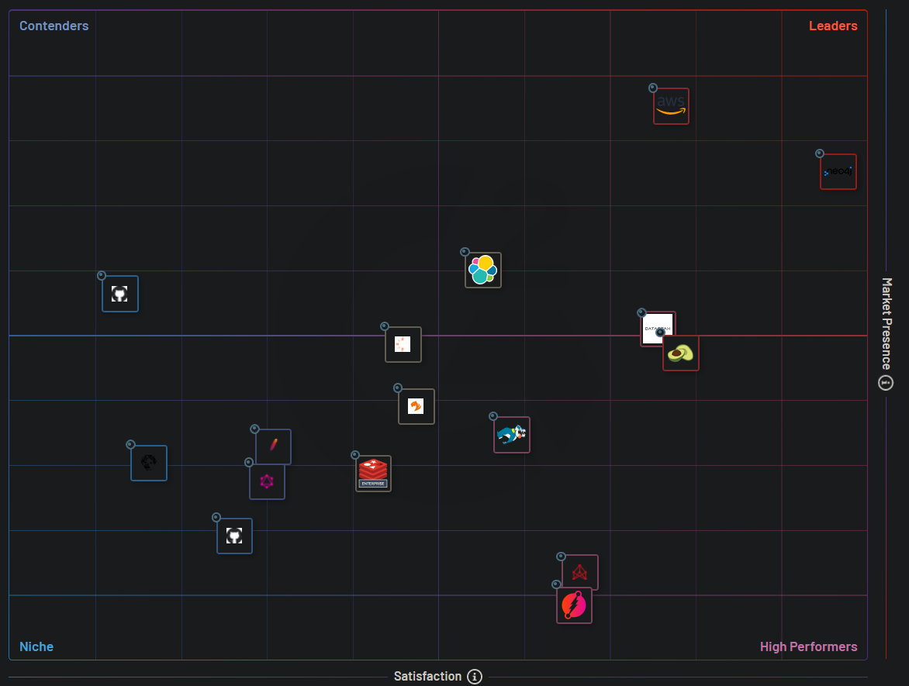

# Neo4j

[Neo4j GDS Machine Learning]<https://www.youtube.com/watch?v=QIrxsNQ9JEs>
Link predicion

## Why `Neo4j`

[High Performance, High Presence]<https://www.g2.com/categories/graph-databases#grid>

## Installation

Prerequisite: JDK 17 installed.

### Linux Install

#### For ubuntu

[ubuntu based install]<https://neo4j.com/docs/operations-manual/5/installation/linux/debian/>

Install Community Edition

    wget -O - https://debian.neo4j.com/neotechnology.gpg.key | sudo apt-key add -
    echo 'deb https://debian.neo4j.com stable latest' | sudo tee -a /etc/apt/sources.list.d/neo4j.list
    sudo apt-get update
    
    apt list -a neo4j
    
    sudo add-apt-repository universe
    
    sudo apt-get install neo4j=1:5.16.0

    sudo systemctl enable neo4j
    sudo systemctl status neo4j
    sudo systemctl stop neo4j
    sudo systemctl start neo4j
    sudo systemctl restart neo4j
    
    (skip) sudo systemctl stop neo4j
    (skip) sudo systemctl disable neo4j
    (skip) sudo apt remove purge neo4j

#### for centos, amazon linux 2023

[amazon linux 2023]<https://neo4j.com/docs/operations-manual/5/installation/linux/rpm/>

Install Community Edition

    rpm --import https://debian.neo4j.com/neotechnology.gpg.key

    cat << EOF >  /etc/yum.repos.d/neo4j.repo
    [neo4j]
    name=Neo4j RPM Repository
    baseurl=https://yum.neo4j.com/stable/5
    enabled=1
    gpgcheck=1
    EOF

    # OR
    sudo vi /etc/yum.repos.d/neo4j.repo
    # add
    [neo4j]
    name=Neo4j RPM Repository
    baseurl=https://yum.neo4j.com/stable/5
    enabled=1
    gpgcheck=1

    sudo yum install neo4j-5.16.0

    export NEO4J_HOME=/var/lib/neo4j

    (skip) sudo systemctl stop neo4j
    (skip) sudo systemctl disable neo4j
    (skip) sudo yum remove purge neo4j

#### Default file locations (linux)

    # bins:
    /usr/bin/neo4j
    /usr/bin/neo4j-admin
    /usr/bin/cypher-shell
    #
    # config files:
    /etc/neo4j/neo4j.conf
    /etc/neo4j/*.*
    #
    # data files
    /var/lib/neo4j> ls /var/lib/neo4j
    certificates  data  import  labs  licenses  plugins  run

### Windows Community Edition Install

[Windows Community Edition]<https://neo4j.com/docs/operations-manual/5/installation/windows/>
[Download Center]<https://neo4j.com/download-center>

Environment:

    set NEO4J_HOME=C:\D\Tools\neo4j-community-5.16.0
    set NEO4J_CONF=%NEO4J_HOME%\conf\neo4j.conf     # path to neo4j.conf
    # add %NEO4j_HOME%\bin to path

    # add to windows service
    neo4j windows-service install
    > Neo4j service installed.

    neo4j help
    neo4j version
    neo4j start
    neo4j restart
    neo4j stop

    (skip) echo server.memory.heap.initial_size=8g >> conf\neo4j.conf
    (skip) echo server.memory.heap.initial_size=16g >> conf\neo4j.conf
    #
    # This is not to update to a new version. This is to force reload properties from `neo4j.con` file:
    neo4j windows-service update
    #
    # After reloading properties from `neo4j.con` file, restart:
    neo4j restart
    > Directories in use:
    > home:         %NEO4J_HOME%
    > config:       %NEO4J_HOME%\conf
    > logs:         %NEO4J_HOME%\logs
    > plugins:      %NEO4J_HOME%\plugins
    > import:       %NEO4J_HOME%\import
    > data:         %NEO4J_HOME%\data
    > certificates: %NEO4J_HOME%\certificates
    > licenses:     %NEO4J_HOME%\licenses
    > run:          %NEO4J_HOME%\run

    (skip) neo4j windows-service uninstall

Note: `Neo4j Desktop` does not have `neo4j-admin`, `neo4j`, and `cypher-shell`

#### Default file locations (windows)

    > Directories in use:
    > home:         %NEO4J_HOME%
    > config:       %NEO4J_HOME%\conf
    > logs:         %NEO4J_HOME%\logs
    > plugins:      %NEO4J_HOME%\plugins
    > import:       %NEO4J_HOME%\import
    > data:         %NEO4J_HOME%\data
    > certificates: %NEO4J_HOME%\certificates
    > licenses:     %NEO4J_HOME%\licenses
    > run:          %NEO4J_HOME%\run

## Default username/password: `neo4j-admin dbms set-initial-password`

**Before starting up the database for the first time**, use `neo4j-admin dbms set-initial-password <password> [--require-password-change]`
for native user `neo4j`.

Otherwise, it will be set to the default password `neo4j`. In that case, you will be prompted to change the default password at first login.

Native user: `neo4j`
Default password: `neo4j`

    (skip. too late. database started already when installed as a window-service) neo4j-admin dbms set-initial-password <password> [--require-password-change]
    (skip. too late. database started already when installed as a window-service) neo4j-admin dbms set-initial-password test@1234
    > Changed password for user 'neo4j'. IMPORTANT: this change will only take effect if performed before the database is started for the first time.
    # if not successful, the default password is `neo4j`.

## Browser

[Browser]<http://localhost:7474/browser/>

[Browser EC2]<http://52.3.85.231:7474/browser/>

`neo4j/test@1234`

## Standard Database / Default Database for Community Edition

- Community Edition can have exactly **one** standard database
- Enterprise Edition can have **any number** of standard databases.
- Default standard database is `neo4j`. It can be configured **before** starting Neo4j for the **first** time.

## The `system` Database

All installations include a built-in database named `system`, which contains **metadata** on the DBMS and **security** configuration.

With this database you can only perform a specific set of administrative tasks, such as managing databases, aliases, servers, and access control.

## CQL stands for Cypher Query Language

[Recover `admin` user and password]<https://neo4j.com/docs/operations-manual/5/authentication-authorization/password-and-user-recovery/>

    :server connect
    :server disconnect

    cypher-shell -u neo4j -p test@1234
    > The client is unauthorized due to authentication failure.
    cypher-shell -u neo4j -p neo4j
    > The client is unauthorized due to authentication failure.

    #
    # Fix
    neo4j stop
    # options 1. ## Keep the `%NEO4J_HOME\data\` folder, but delete everything under it:
    del %NEO4J_HOME\data\*
    # options 2.
    del %NEO4J_HOME
    # then,
    # option 1. set default password
    neo4j-admin dbms set-initial-password test@1234
    # OR
    # start `neo4j` and use default password `neo4j`:
    neo4j start
    cypher-shell -u neo4j -p neo4j
    > Password change required
    > new password: test@1234
    > confirm password: test@1234
    > Connected to Neo4j using Bolt protocol version 5.4 at neo4j://localhost:7687 as user neo4j.
    > Type :help for a list of available commands or :exit to exit the shell.
    > Note that Cypher queries must end with a semicolon.
    #
    cypher-shell -u neo4j -p test@1234
    cypher-shell -a neo4j://localhost:7687 -u neo4j -p test@1234

## `cypher-shell` commands

    cypher-shell -u neo4j -p test@1234
    cypher-shell -a neo4j://localhost:7687 -u neo4j -p test@1234
    cypher-shell -a neo4j://52.3.85.231:7687 -u neo4j -p test@1234

    :help
    :exit
    :sysinfo

    SHOW CURRENT USER;

## manage Users

[Manage Users]<https://neo4j.com/docs/operations-manual/5/authentication-authorization/manage-users/>

[Recover `admin` user and password]<https://neo4j.com/docs/operations-manual/5/authentication-authorization/password-and-user-recovery/>

## Reusing Variables

Both `CREATE` and `MATCH` create reusable variables:

    # `charlie` and `oliver` are reusable variables created by `CREATE`
    # `CREATE` clause create the nodes `Charlie Sheen` and `Oliver Stone` and binds them to the `charlie` and `oliver` variables respectively.
    CREATE (charlie:Person:Actor {name: 'Charlie Sheen'}), (oliver:Person:Director {name: 'Oliver Stone'})

    # `CREATE` clause create the nodes `Charlie Sheen` and binds it to the `charlie`. But it does **NOT** create `oliver` variables respectively.
    CREATE (charlie:Person:Actor {name: 'Charlie Sheen'}), (:Person:Director {name: 'Oliver Stone'})

    # `charlie` and `oliver` are reusable variables created by `MATCH`
    # `MATCH` clause finds the nodes `Charlie Sheen` and `Oliver Stone` and binds them to the `charlie` and `oliver` variables respectively.
    MATCH (charlie:Person {name: 'Charlie Sheen'}), (oliver:Person {name: 'Oliver Stone'})

    # reusing variables `charlie` and `oliver` created in previous QUERIES
    CREATE (charlie)-[:ACTED_IN {role: 'Bud Fox'}]->(wallStreet:Movie {title: 'Wall Street'})<-[:DIRECTED]-(oliver)

## Create Nodes

    CREATE (sample1),(sample2) 
    MATCH (n) RETURN n

    CREATE (Dhawan:player{name: "Shikar Dhawan", YOB: 1985, POB: "Delhi"}) RETURN Dhawan

    CREATE (Ind:Country {name: "India"})

## Create Relationship

### Creating a New Relationship and Two New Nodes

    # Syntax
    CREATE (node1)-[:RelationshipType]->(node2)
    
    CREATE (Dhawan)-[r:BATSMAN_OF]->(Ind) RETURN Dhawan, Ind

### Creating a Relationship Between the Existing Nodes

    # Syntax
    MATCH (a:LabeofNode1), (b:LabeofNode2) 
       WHERE a.name = "nameofnode1" AND b.name = "nameofnode2" 
    CREATE (a)-[:Relation]->(b) 
    RETURN a, b 

    MATCH (a:player), (b:Country) WHERE a.name = "Dhawan" AND b.name = "India" 
    CREATE (a)-[r: BATSMAN_OF]->(b) 
    RETURN a,b 

### Creating a Relationship with Label and Properties

    # Syntax
    CREATE (node1)-[label:Rel_Type {key1:value1, key2:value2, . . . n}]-> (node2)

    MATCH (a:player), (b:Country) WHERE a.name = "Shikar Dhawan" AND b.name = "India" 
    CREATE (a)-[r:BATSMAN_OF {Matches:5, Avg:90.75}]->(b)  
    RETURN a,b 

### Creating a Complete Path

    # Syntax
    CREATE p = (Node1 {properties})-[:Relationship_Type]->
       (Node2 {properties})-[:Relationship_Type]->(Node3 {properties}) 
    RETURN p 

## Merge

`MERGE` command searches for a given pattern in the graph. If it exists, then it returns the results. If it does **NOT** exist in the graph,
then it creates a new node/relationship and returns the results.

    # Syntax
    MERGE (node: label {properties . . . . . . . })

### Merging a Node with a Label

    # Syntax
    MERGE (node:label) RETURN node

    MERGE (Jadeja:player) RETURN Jadeja 

    MERGE (CT2013:Tournament{name: "ICC Champions Trophy 2013"}) 
    RETURN CT2013, labels(CT2013)

### Merging a Node with Properties

    # Syntax
    MERGE (node:label {key1:value, key2:value, key3:value . . . . . . . . }) 

    MERGE (Jadeja:player {name: "Ravindra Jadeja", YOB: 1988, POB: "NavagamGhed"}) 
    RETURN Jadeja 

### OnCreate and OnMatch

    # Syntax
    MERGE (node:label {properties . . . . . . . . . . .}) 
    ON CREATE SET property.isCreated ="true" 
    ON MATCH SET property.isFound ="true"

    MERGE (Jadeja:player {name: "Ravindra Jadeja", YOB: 1988, POB: "NavagamGhed"}) 
    ON CREATE SET Jadeja.isCreated = "true" 
    ON MATCH SET Jadeja.isFound = "true" 
    RETURN Jadeja 

    MERGE (Jadeja:player {name: "Ravindra Jadeja", YOB: 2024, POB: "NavagamGhed"}) 
    ON CREATE SET Jadeja.isCreated = "true" 
    ON MATCH SET Jadeja.isFound = "true" 
    RETURN Jadeja 

### Merge a Relationship

    MATCH (a:Country), (b:Tournament) 
       WHERE a.name = "India" AND b.name = "ICC Champions Trophy 2013" 
       MERGE (a)-[r:WINNERS_OF]->(b) 
    RETURN a, b 

    match (a:Tournament) return a

## Set Clause --- Create a new property in a node

    # Syntax
    MATCH (node:label{properties . . . . . . . . . . . . . . }) 
    SET node.property = value 
    RETURN nod

    match (a:player) where a.POB = "Delhi" and a.YOB = 1985 return a

    MATCH (Dhawan:player{name: "Shikar Dhawan", YOB: 1985, POB: "Delhi"}) 
    SET Dhawan.highestscore = 187 
    RETURN Dhawan

## Removing a Property with `SET`

    # Syntax
    MATCH (node:label {properties}) 
    SET node.property = NULL 
    RETURN node 

    MATCH (Dhawan:player{YOB: 1985, POB: "Delhi"}) 
    SET Dhawan.highestscore = null
    RETURN Dhawan

## Setting Multiple Properties

    # Syntax
    MATCH (node:label {properties}) 
    SET node.property1 = value, node.property2 = value 
    RETURN node 

    MATCH (Dhawan:player{YOB: 1985, POB: "Delhi"}) 
    SET Dhawan.highestscore = 199, Dhawan.YOB = 1986
    RETURN Dhawan
    
    # Or
    MATCH (a:player{YOB: 1985, POB: "Delhi"}) 
    SET a.highestscore = 199, a.YOB = 1986
    RETURN a

### Setting a Label on a Node

    # Syntax
    MATCH (n {properties . . . . . . . }) 
    SET n :label 
    RETURN n 

    CREATE (Anderson {name: "James Anderson", YOB: 1982, POB: "Burnely"})
    
    MATCH (Anderson {name: "James Anderson", YOB: 1982, POB: "Burnely"}) 
    SET Anderson: player 
    RETURN Anderson 

### Setting Multiple Labels on a Node

    # Syntax
    MATCH (n {properties . . . . . . . }) 
    SET n :label1:label2 
    RETURN n 
    
    CREATE (Ishant {name: "Ishant Sharma", YOB: 1988, POB: "Delhi"}) 

    MATCH (Ishant {name: "Ishant Sharma", YOB: 1988, POB: "Delhi"}) 
    SET Ishant: player:person 
    RETURN Ishant 

    match (Ishant {name: "Ishant Sharma", YOB: 1988}) set Ishant:player:person return Ishant
    
    # Or
    match (a {name: "Ishant Sharma", YOB: 1988}) set a:player:person return a

## Delete Clause

    # delete all nodes and relationships
    # MATCH (n) DETACH DELETE n

### Deleting a Particular Node

    # Syntax
    MATCH (node:label {properties . . . . . . . . . .  }) 
    DETACH DELETE node

    CREATE (Ishant:player {name: "Ishant Sharma", YOB: 1988, POB: "Delhi"}) 
    
    MATCH (Ishant:player {name: "Ishant Sharma", YOB: 1988, POB: "Delhi"}) 
    DETACH DELETE Ishant

    match (a {name: "Ishant Sharma", YOB: 1988}) detach delete a

## Remove Clause

`DELETE` - Delete Nodes and associated Relaionships
`REMOVE` - Remove labels and properties
`SET property = NULL` - Same as Remove a property

### Removing a Property with `REMOVE`

    # Syntax
    MATCH (node:label{properties . . . . . . . }) 
    REMOVE node.property 
    RETURN node 

    match (a:player {POB: "Delhi"}) remove a.highestscore return a

    match (a:player:person {}) return a

### Removing a Label From a Node

    # Syntax
    MATCH (node:label {properties . . . . . . . . . . . }) 
    REMOVE node:label 
    RETURN node 

    match (a:player:person {}) return a
    match (a:player:person {}) remove a:player return a

### Removing Multiple Labels

    # Syntax
    MATCH (node:label1:label2 {properties . . . . . . . . }) 
    REMOVE node:label1:label2 
    RETURN node

    # match (a:player:person {}) remove a:player return a

    CREATE (Ishant:person:player {name: "Ishant Sharma", YOB: 1988, POB: "Delhi"}) 

    MATCH (Ishant:player:person {name: "Ishant Sharma", YOB: 1988, POB: "Delhi"}) 
    REMOVE Ishant:player:person 
    RETURN Ishant 

## FOREACH Clause

    # Syntax
    MATCH p = (start node)-[*]->(end node) 
    WHERE start.node = "node_name" AND end.node = "node_name" 
    FOREACH (n IN nodes(p) | SET n.marked = TRUE) 

    # create
    CREATE p = (Dhawan {name:"Shikar Dhawan"})-[:TOPSCORRER_OF]->(Ind{name: 
       "India"})-[:WINNER_OF]->(CT2013{name: "Champions Trophy 2013"}) 
    RETURN p 
    
    # foreach
    MATCH p = (Dhawan)-[*]->(CT2013) 
       WHERE Dhawan.name = "Shikar Dhawan" AND CT2013.name = "Champions Trophy 2013" 
    FOREACH (n IN nodes(p) | SET n.marked = TRUE)

    # verify
    MATCH p = (Dhawan)-[*]->(CT2013) 
       WHERE Dhawan.name = "Shikar Dhawan" AND CT2013.name = "Champions Trophy 2013" 
    return p

## MATCH Clause

### NULL

Use `IS NULL` and `IS NOT NULL`

    match (n) where n.POB is null return n

    match (n) where n.POB is not null return n
    
    # The property existence syntax `... exists(variable.property)` is no longer supported. Please use `variable.property IS NOT NULL` instead
    # (not supported) match (n) where not EXISTS(n.POB) return n

### Match all

    MATCH (n) RETURN n

### Matching a label

    # Syntax
    MATCH (node:label) 
    RETURN node 

    # create
    CREATE (Dhoni:player {name: "MahendraSingh Dhoni", YOB: 1981, POB: "Ranchi"}) 
    CREATE (Ind:Country {name: "India", result: "Winners"}) 
    CREATE (CT2013:Tornament {name: "ICC Champions Trophy 2013"}) 
    CREATE (Ind)-[r1:WINNERS_OF {NRR:0.938 ,pts:6}]->(CT2013) 
    
    CREATE (Dhoni)-[r2:CAPTAIN_OF]->(Ind)  
    CREATE (Dhawan:player{name: "Shikar Dhawan", YOB: 1995, POB: "Delhi"}) 
    CREATE (Jadeja:player {name: "Ravindra Jadeja", YOB: 1988, POB: "NavagamGhed"})  
    
    CREATE (Dhawan)-[:TOP_SCORER_OF {Runs:363}]->(Ind) 
    CREATE (Jadeja)-[:HIGHEST_WICKET_TAKER_OF {Wickets:12}]->(Ind) 

    MATCH (n:player) RETURN n 

### Match by Relationship

    # Syntax
    MATCH (node:label)<-[: Relationship]-(n) 
    RETURN n 

    MATCH (Ind:Country {name: "India", result: "Winners"})<-[: TOP_SCORER_OF]-(n) 
    RETURN n.name 

### Delete All Nodes

    MATCH (n) detach delete n

### OPTIONAL MATCH Clause

    # Syntax
    MATCH (node:label {properties. . . . . . . . . . . . . .}) 
    OPTIONAL MATCH (node)-->(x) 
    RETURN x

    MATCH (a:Tornament {name: "ICC Champions Trophy 2013"}) 
    OPTIONAL MATCH (a)-->(x) 
    RETURN x 

## WHERE Clause

    # Syntax
    MATCH (label)  
    WHERE label.country = "property" 
    RETURN label 

### WHERE Clause with Multiple Conditions

    # Syntax
    MATCH (emp:Employee)  
    WHERE emp.name = 'Abc' AND emp.name = 'Xyz' 
    RETURN emp 
    
    MATCH (player)  
    WHERE player.country = "India" AND player.runs >=175 
    RETURN player 

### Using Relationship with Where Clause

    MATCH (n) 
    WHERE (n)-[:TOP_SCORER_OF]->({name: "India", result: "Winners"}) 
    RETURN n 

    MATCH (n)
    WHERE (n)-[:TOP_SCORER_OF]->({name: "India"}) 
    return n

    MATCH (n) 
    WHERE (n)-[:TOP_SCORER_OF {Runs: 363}]->({name: "India"}) 
    RETURN n

## COUNT Clause

    # Syntax
    MATCH (n { name: 'A' })-->(x) 
    RETURN n, count(0), count(1), count(*) 

    MATCH (n) 
    WHERE (n)-[:TOP_SCORER_OF {Runs: 363}]->({name: "India"}) 
    RETURN n, count(*), count(0), count(1), count(*)

### Group Count

    Match(n{name: "India", result: "Winners"})-[r]-(x)  
    RETURN type (r), count(*) 

    Match(n{name: "India", result: "Winners"})-[r]-(x)  
    RETURN type (r), count(*), x.name

## RETURN Clause

    CREATE (Ind)-[r1:WINNERS_OF {NRR:0.938 ,pts:6}]->(CT2013) 
    CREATE (Dhoni)-[r2:CAPTAIN_OF]->(Ind) 
    RETURN r1, r2 , Ind, CT2013

    # return property
    Match (node:label {properties . . . . . . . . . . }) 
    Return node.property 

    Match (Dhoni:player {name: "MahendraSingh Dhoni", YOB: 1981, POB: "Ranchi"}) 
    Return Dhoni.name, Dhoni.POB 

### Returning All Elements

    Match p = (n {name: "India", result: "Winners"})-[r]-(x)  
    RETURN *

### Returning a Variable With a Column Alias

    Match (Dhoni:player {name: "MahendraSingh Dhoni", YOB: 1981, POB: "Ranchi"}) 
    Return Dhoni.POB as Place_Of_Birth

## ORDER BY Clause

    # Syntax
    MATCH (n)  
    RETURN n.property1, n.property2 . . . . . . . .  
    ORDER BY n.property

    CREATE(Dhawan:player{name:"shikar Dhawan", YOB: 1985, runs:363, country: "India"})
    CREATE(Jonathan:player{name:"Jonathan Trott", YOB:1981, runs:229, country:"South Africa"})
    CREATE(Sangakkara:player{name:"Kumar Sangakkara", YOB:1977, runs:222, country:"Srilanka"})
    CREATE(Rohit:player{name:"Rohit Sharma", YOB: 1987, runs:177, country:"India"})
    CREATE(Virat:player{name:"Virat Kohli", YOB: 1988, runs:176, country:"India"})
    
    MATCH (n)  
    RETURN n.name, n.runs 
    ORDER BY n.runs 
    
    MATCH (n)  
    RETURN n.name, n.runs 
    ORDER BY n.runs ASC
    
    MATCH (n)  
    RETURN n.name, n.runs 
    ORDER BY n.runs DESC

    MATCH (n) 
    RETURN n 
    ORDER BY n.age, n.name 
    
    MATCH (n{YOB: 1988}) 
    RETURN n 
    ORDER BY n.name, n.YOB

## LIMIT Clause

    MATCH (n) 
    RETURN n 
    ORDER BY n.name 
    LIMIT 3 

## SKIP Clause

    MATCH (n)  
    RETURN n.name, n.runs 
    ORDER BY n.runs DESC 
    SKIP 3 

## WITH Clause

    # Syntax
    MATCH (n) 
    WITH n 
    ORDER BY n.name 
    RETURN collect(n.name) 

    MATCH (n) 
    with n
    where n.name <> "India"
    RETURN collect(n.name) 

    # same as `without WITH`
    MATCH (n) 
    where n.name <> "India"
    RETURN collect(n.name) 

## UNWIND Clause

    UNWIND [a, b, c, d] AS x 
    RETURN x 

## String Functions

UPPER
LOWER
SUBSTRING
Replace

## Aggregation Functions

COUNT
MAX
MIN
AVG
SUM

## INDEX

    # Syntax
    CREATE INDEX ON:label (node) 
    DROP INDEX ON:label(node) 

    CREATE (Dhawan:player{name: "shikar Dhawan", YOB: 1995, POB: "Delhi"})
    CREATE INDEX ON:player(Dhawan) 
    DROP INDEX ON:player(Dhawan) 

## Create UNIQUE Constraint

    # Syntax
    MATCH (root {name: "Dhawan"}) 
    CREATE UNIQUE (root)-[:LOVES]-(someone) 
    RETURN someone 

    CREATE CONSTRAINT FOR (n:player) REQUIRE n.id IS UNIQUE

## Drop UNIQUE

    # Syntax

    SHOW CONSTRAINTS
    DROP CONSTRAINT <constraint_name>

## `Neo4j` Cyclic Relationships Will Causes `StackOverflow` Exception

**!!! Important !!!**
**!!! Trick !!!**

Cyclic relationship will cause StackOverflow error: `person: [!!!com.learn.shein.neo4j.entity.Person@29fef6c0=>java.lang.StackOverflowError:null!!!]`
